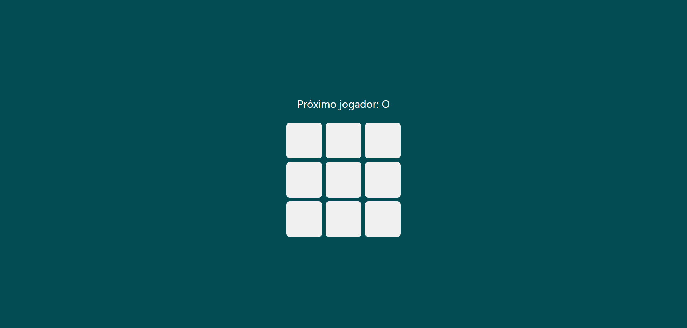
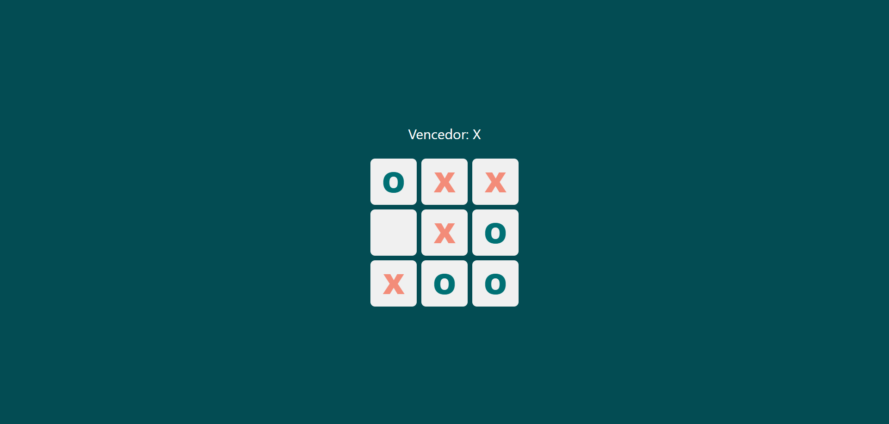

# Jogo da velha 

Projeto do clássico jogo-da-velha, desenvolvido em React.js.


## Screenshots


<br><br>



## Rodando localmente

Clone o projeto

```bash
  git clone https://github.com/Debora-Carvalho/jogo-velha-react.git
```

Entre no diretório do projeto

```bash
  cd jogo-velha-react
```

Instale as dependências

```bash
  npm install
```

Inicie o servidor

```bash
  npm run start
```


## Desenvolvido por:

- [@Debora-Carvalho](https://github.com/Debora-Carvalho)

